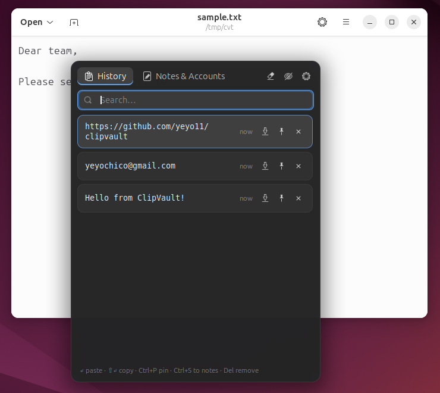
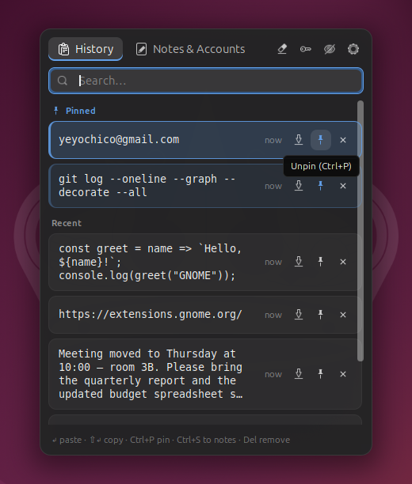
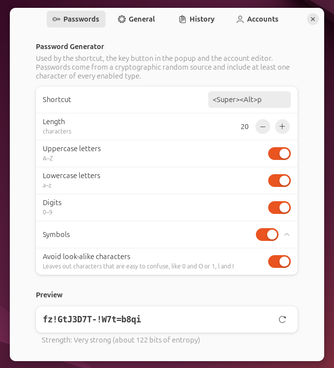

<div align="center">

# ClipVault

**A clipboard history for GNOME that pops up right where you type, with a private vault for notes and accounts.**

Press <kbd>Super</kbd>+<kbd>V</kbd> while typing: the history pops up right under your text cursor, and whatever you pick is typed into that field.

[](LICENSE)

[](https://github.com/yeyo11/clipvault/actions/workflows/ci.yml)

 

</div>

## Features

**Clipboard history**
- Opens with <kbd>Super</kbd>+<kbd>V</kbd> **right below the text cursor** of the field you are typing in.
  If the app doesn't report its cursor, it opens next to the mouse pointer. It can also open centered.
- Records **text and images**, skips duplicates and moves reused items back to the top.
- **Instant search**, full keyboard navigation and **pinned items** that survive "Clear history".
  Pinned items get their own highlighted section at the top, so you can spot them at a glance.
- Choose how many lines each item shows before it is cut with "…" (4 by default).
- **Pastes straight into the previous window**. Use <kbd>Shift</kbd>+<kbd>Enter</kbd> to copy without pasting.
- Turn any history item into a saved note with <kbd>Ctrl</kbd>+<kbd>S</kbd>.

**Notes & accounts vault** (<kbd>Super</kbd>+<kbd>Shift</kbd>+<kbd>V</kbd>)
- **Notes**: snippets you paste often, such as addresses, commands, templates or Wi-Fi details.
- **Accounts**: title, username, password, URL and notes, with one-click *Username* / *Password* paste buttons.
- **Passwords live in the GNOME Keyring** (libsecret) and are never written to disk in plain text.
- Copied passwords are **cleared from the clipboard after 30 s** and never enter the history.
- **Password generator** (<kbd>Super</kbd>+<kbd>Alt</kbd>+<kbd>P</kbd>): creates a strong password and types it into
  the field you are in, which is perfect for sign-up forms. A notification lets you **save it as an account** right away.
  You can configure its length, character types (uppercase, lowercase, digits, symbols), which symbols to use,
  and whether to avoid look-alike characters. The preview shows its strength live.

**Privacy**
- **Private mode** stops all recording. Toggle it from the popup, the settings, or by middle-clicking the top bar icon.
- Honors the `x-kde-passwordManagerHint` flag that password managers such as KeePassXC set, so their secrets are never recorded.
- All data stays local, in files readable only by you (`0600`).

**Integration**
- Takes over <kbd>Super</kbd>+<kbd>V</kbd>, which GNOME uses for the notification list, and gives it back when the extension is disabled.
- Top bar icon (optional): left click for history, right click for notes, middle click for private mode.
- Every button has a **tooltip** explaining what it does, including its keyboard shortcut.
- Translatable UI. It ships in English and Spanish.

<p align="center"></p>

<details>
<summary><b>More screenshots</b></summary>

| Tooltips | Search | Account editor |
|---|---|---|
|  |  |  |

| Preferences | Password generator |
|---|---|
|  |  |

</details>

## Installation

Requires GNOME Shell 46, 47 or 48, which covers Ubuntu 24.04 and later and Fedora 40 and later.

### Option 1: extensions.gnome.org (easiest, updates automatically)

Pending review. Once approved, it can be installed with one click from its page on
[extensions.gnome.org](https://extensions.gnome.org) or from the **Extension Manager** app,
and updates will arrive automatically.

### Option 2: download the latest release (no git or build tools needed)

```bash
wget https://github.com/yeyo11/clipvault/releases/latest/download/clipvault@yeyo11.github.io.shell-extension.zip
gnome-extensions install --force clipvault@yeyo11.github.io.shell-extension.zip
```

### Option 3: build from source

Needs `git`, `make` and `gettext` (`sudo apt install git make gettext` on Ubuntu).

```bash
git clone https://github.com/yeyo11/clipvault.git
cd clipvault
make install
```

### After installing

1. **Restart GNOME Shell** so it detects the extension:
   - **Wayland** (Ubuntu's default): log out and log back in.
   - **X11**: press <kbd>Alt</kbd>+<kbd>F2</kbd>, type `r` and press <kbd>Enter</kbd>.
2. **Enable it**: `gnome-extensions enable clipvault@yeyo11.github.io`, or use the Extensions app.

> **Tip:** disable any other clipboard manager that uses <kbd>Super</kbd>+<kbd>V</kbd>, for example
> `gnome-extensions disable clipboard-indicator@tudmotu.com`.

## Updating

Your history, notes and passwords are kept when you update.

| Installed with | How to update |
|---|---|
| extensions.gnome.org | Automatic. You can also check in the **Extension Manager** app. |
| Release zip (option 2) | Run the same two commands again: the link always points to the latest version. |
| Source (option 3) | `cd clipvault && git pull && make install` |

Then restart GNOME Shell as described above. You don't need to enable it again.
The installed version is shown in **Preferences → Accounts → About**.

## Usage

| Key | History tab | Notes & Accounts tab |
|---|---|---|
| <kbd>↑</kbd> <kbd>↓</kbd> <kbd>PgUp</kbd> <kbd>PgDn</kbd> | Move selection | Move selection |
| <kbd>Enter</kbd> | Paste | Paste note / account password |
| <kbd>Shift</kbd>+<kbd>Enter</kbd> | Copy only | Copy only |
| <kbd>Ctrl</kbd>+<kbd>U</kbd> | — | Paste account username |
| <kbd>Ctrl</kbd>+<kbd>P</kbd> | Pin / unpin | Pin / unpin |
| <kbd>Ctrl</kbd>+<kbd>S</kbd> | Save item as note | — |
| <kbd>Ctrl</kbd>+<kbd>N</kbd> | New note | New note |
| <kbd>Ctrl</kbd>+<kbd>E</kbd> | — | Edit |
| <kbd>Del</kbd> | Remove (when search is empty; <kbd>Shift</kbd>+<kbd>Del</kbd> always) | Remove (press twice to confirm) |
| <kbd>Tab</kbd> | Switch to notes | Switch to history |
| <kbd>Esc</kbd> | Clear search, then close | Clear search, then close |

Anywhere, <kbd>Super</kbd>+<kbd>Alt</kbd>+<kbd>P</kbd> generates a password and pastes it into the focused field.
The 🔑 button in the popup does the same.

Typing always goes to the search box. In the editor, <kbd>Tab</kbd> moves between fields,
<kbd>Ctrl</kbd>+<kbd>S</kbd> or <kbd>Ctrl</kbd>+<kbd>Enter</kbd> saves, and <kbd>Esc</kbd> cancels.

## Settings

Open them from the ⚙ button in the popup, from the Extensions app, or with `make prefs`.

| Setting | Default |
|---|---|
| Open history / notes shortcuts | <kbd>Super</kbd>+<kbd>V</kbd> / <kbd>Super</kbd>+<kbd>Shift</kbd>+<kbd>V</kbd> |
| Generate password shortcut | <kbd>Super</kbd>+<kbd>Alt</kbd>+<kbd>P</kbd> |
| Take over Super+V from GNOME | On |
| Paste on select | On |
| Keys used to paste text | <kbd>Shift</kbd>+<kbd>Insert</kbd> (works in terminals too) or <kbd>Ctrl</kbd>+<kbd>V</kbd> |
| Popup position / size | Next to the text cursor (falls back to pointer), 420×540 |
| History size (unpinned items) | 100 |
| Lines shown per item | 4 |
| Keep history across sessions / save images / max image size | On / On / 10 MiB |
| Private mode / ignore secret content | Off / On |
| Clear copied passwords after | 30 s |
| Password generator | 20 characters; uppercase, lowercase, digits and symbols `!@#$%&*-_=+?`; avoids look-alikes |

## Privacy & security

| What | Where |
|---|---|
| History | `~/.local/share/clipvault/history.json` |
| Images | `~/.local/share/clipvault/images/` |
| Notes and account metadata (title, username, URL, notes) | `~/.local/share/clipvault/notes.json` |
| **Account passwords** | **GNOME Keyring**, shown as *"ClipVault: …"* in *Passwords and Keys* (Seahorse) |

- The data directory is `0700` and its files are `0600`.
- Nothing is ever sent over the network.
- If libsecret is not available, which is very unusual on a GNOME desktop, passwords fall back to
  `notes.json` **unencrypted**, and the editor shows a warning.
- The history itself is **not encrypted**. Anything you copy is stored in plain text, as with every
  clipboard manager. Use private mode or a password manager that sets the secret hint for sensitive data.

See [SECURITY.md](SECURITY.md) to report a vulnerability.

## Troubleshooting

<details>
<summary><b>Super+V does nothing or opens the notification list</b></summary>

Check that *Take over Super+V from GNOME* is enabled and that no other extension binds the same key.
Run `make logs` and press the shortcut to see errors.
</details>

<details>
<summary><b>The popup opens next to the mouse instead of the text cursor</b></summary>

ClipVault learns where the text cursor is from the input method framework (IBus), the same way GNOME
places the input-method candidate window. Most GTK, Qt, LibreOffice and terminal apps report it. Some
don't: certain Electron apps, and apps started without IBus support, for example with
`GTK_IM_MODULE=xim`. In those apps the popup falls back to the mouse pointer.
</details>

<details>
<summary><b>Selecting an item copies it but does not paste</b></summary>

Some apps ignore <kbd>Shift</kbd>+<kbd>Insert</kbd>. Switch *Keys used to paste text* to <kbd>Ctrl</kbd>+<kbd>V</kbd>.
Images are always pasted with <kbd>Ctrl</kbd>+<kbd>V</kbd>.
</details>

<details>
<summary><b>I get a "keyring" password prompt</b></summary>

Your login keyring is locked. Unlock it with your login password once. ClipVault needs it to read or
save account passwords.
</details>

## Uninstall

```bash
gnome-extensions uninstall clipvault@yeyo11.github.io
rm -rf ~/.local/share/clipvault                     # history, images and notes
# Account passwords: remove the "ClipVault: …" entries in Passwords and Keys (Seahorse)
```

## Contributing

Bug reports, ideas, translations and pull requests are welcome. See [CONTRIBUTING.md](CONTRIBUTING.md)
for the development setup, code layout and how to add a translation.

## Credits

Some techniques, such as simulating <kbd>Shift</kbd>+<kbd>Insert</kbd> to paste and listening to Mutter's
selection changes, were inspired by
[SUPERCILEX/gnome-clipboard-history](https://github.com/SUPERCILEX/gnome-clipboard-history).
ClipVault's code is written from scratch.

## License

Copyright © 2026 Jose Antonio Garrido.

ClipVault is free software: you can redistribute it and/or modify it under the terms of the
[GNU General Public License](LICENSE), version 3 or (at your option) any later version.
